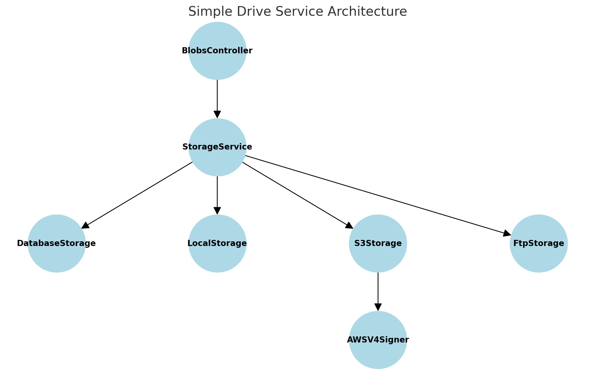

# Simple Drive: Multi-Storage Backend Service

This project is a Ruby on Rails application designed to demonstrate the integration of multiple storage backends, including database storage, local file system storage, S3-compatible storage, and FTP storage. It provides a single interface to store and retrieve files (blobs) using a consistent API.

## Table of Contents
- [Features](#features)
- [Prerequisites](#prerequisites)
- [Installation](#installation)
- [Configuration](#configuration)
- [Usage](#usage)
- [Limitations and Known Issues](#limitations-and-known-issues)
- [Structure Diagram](#structure-diagram)
- [Contributing](#contributing)
- [License](#license)

## Features
- **Multiple Storage Backends**: Supports storing blobs in a database, local file system, Amazon S3-compatible storage, and FTP storage.
- **RESTful API**: Provides endpoints to store and retrieve files using a simple JSON-based interface.
- **Pluggable Storage**: Configure the storage backend via environment variables.
- **AWS V4 Signing**: Implementation for signing S3 requests using AWS Signature Version 4.

## Prerequisites
- Ruby 3.x and Rails 7.x
- Docker and Docker Compose
- PostgreSQL
- MinIO or S3-compatible service
- FTP Server (optional)

## Installation
1. Clone the repository:

    ```
    git clone https://github.com/your-repo/simple-drive.git
    cd simple-drive
    ```

2. Copy the environment configuration:

    ```
    cp .env.example .env
    ```

3. Build and run the application using Docker Compose:

    ```
    docker-compose up --build
    ```

4. Set up the database:

    ```
    docker-compose run web rails db:create db:migrate
    ```

## Configuration
The application uses environment variables to configure the storage backend. Update the `.env` file with the following variables based on your desired storage type:

- **General Settings**:
  - `DATABASE_HOST`: The hostname of the PostgreSQL database.
  - `DATABASE_USER`: The database user.
  - `DATABASE_PASSWORD`: The database password.
  - `DATABASE_NAME`: The database name.

- **S3 Storage Configuration**:
  - `S3_BUCKET`: The bucket name for S3 storage.
  - `S3_ENDPOINT`: The endpoint URL for S3-compatible storage.
  - `S3_ACCESS_KEY_ID`: The access key for S3.
  - `S3_SECRET_ACCESS_KEY`: The secret key for S3.

- **FTP Storage Configuration**:
  - `FTP_HOST`: The hostname of the FTP server.
  - `FTP_USER`: The FTP username.
  - `FTP_PASSWORD`: The FTP password.
  - `FTP_BASE_DIRECTORY`: The base directory on the FTP server.

## Usage
### Store a Blob
To store a blob, make a POST request to `/v1/blobs` with the following JSON body:

{ "id": "any_valid_string_or_identifier", "data": "SGVsbG8gU2ltcGxlIFN0b3JhZ2UgV29ybGQh" }

- The `id` field is a unique identifier for the blob.
- The `data` field is the Base64 encoded binary data that you want to store.

### Retrieve a Blob
To retrieve a blob, make a GET request to `/v1/blobs/<id>`. Replace `<id>` with the unique identifier used when storing the blob.

The response will look like:

{ "id": "any_valid_string_or_identifier", "data": "SGVsbG8gU2ltcGxlIFN0b3JhZ2UgV29ybGQh", "size": "27", "created_at": "2023-01-22T21:37:55Z" }

- `size`: The size of the stored blob in bytes.
- `created_at`: The timestamp when the blob was created.

## Limitations and Known Issues
- **AWS V4 Signing**: The implementation for AWS Signature Version 4 is not fully complete, and there may be issues with certain S3-compatible services. Further testing and debugging are required.
- **FTP Storage**: FTP storage is provided as a proof-of-concept. Connections may fail due to various FTP server configurations, and passive mode might not work in all scenarios.
- **Authentication**: Simple token-based authentication is implemented but not suitable for production.

## Structure Diagram
Below is the diagram showing the structure and interaction between different components of the application:



- **BlobsController**: Interacts with the `StorageService` to store and retrieve blobs.
- **StorageService**: Acts as a central manager that directs requests to different storage backends based on configuration.
- **Storage Backends**:
    - `DatabaseStorage`: Stores blob metadata and content in a PostgreSQL database.
    - `LocalStorage`: Stores blobs as files in a specified local directory.
    - `S3Storage`: Uses S3-compatible storage (e.g., AWS S3, MinIO) to store blobs with AWS V4 signing.
    - `FtpStorage`: Stores and retrieves blobs from an FTP server (basic implementation).

## Contributing
Feel free to open issues or submit pull requests to contribute to the project.

## License
This project is licensed under the MIT License.
